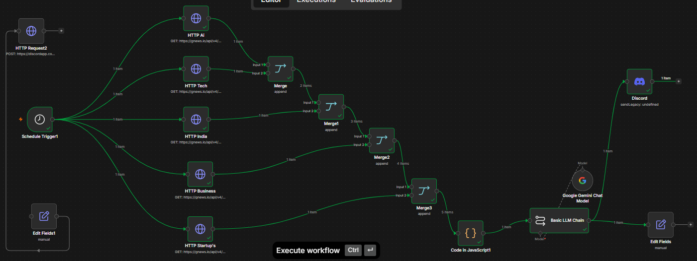

# 🚀 AI News & Tech Intelligence Bot

An autonomous AI-powered News Intelligence Bot built with **n8n**, **Discord**, and **GNews API**.

This project automatically collects news from multiple categories, merges the results into a unified intelligence feed, and delivers curated updates directly to a Discord server.

---

# ✨ Features

* 📰 Multi-category news aggregation
* 🤖 Discord bot integration
* ⏰ Automated scheduling
* 🌍 Real-time news retrieval
* 🔄 Multiple HTTP Request pipelines
* 🔗 Merge-based workflow architecture
* 📊 Scalable design for future AI enhancements

---

# 📂 News Categories

The bot currently collects news from:

* 🤖 Artificial Intelligence
* 💻 Technology
* 🇮🇳 India
* 🌍 World
* 🔒 Cyber Security
* 💹 Business
* 🚀 Startups

---

# 🏗 Workflow Architecture

```
                   Schedule Trigger
                           |
     -------------------------------------------------
     |      |      |      |      |       |          |
     |      |      |      |      |       |          |
    AI    Tech   India  World  Cyber  Business  Startup
     |      |      |      |      |       |          |
 HTTP  HTTP  HTTP  HTTP  HTTP   HTTP     HTTP
     |      |      |      |      |       |          |
     -------------------------------------------------
                           |
                        Merge
                           |
                        Merge
                           |
                        Merge
                           |
                        Merge
                           |
                        Merge
                           |
                        Merge
                           |
                        Discord
```

---

# 🛠 Technologies Used

* n8n Desktop
* Discord Bot API
* GNews API
* HTTP Request Nodes
* Merge Nodes
* Scheduled Automation

---

# ⚙️ How It Works

1. Schedule Trigger starts the workflow.
2. Seven HTTP Request nodes fetch news from different categories.
3. Merge nodes combine all news streams.
4. The final output is sent to a Discord server.
5. Users receive a centralized daily intelligence report.

---

# 📸 Example Output  :



```
📰 DAILY INTELLIGENCE REPORT

🤖 AI
• Latest AI developments

💻 Technology
• Major technology updates

🇮🇳 India
• National headlines

🌍 World
• Global events

🔒 Cyber Security
• Security alerts

💹 Business
• Market movements

🚀 Startups
• Startup ecosystem updates
```

---

# 🚧 Planned Improvements

* AI-powered summarization
* Duplicate article removal
* Dynamic category classification
* OpenAI integration
* Interactive Discord commands
* Database storage
* Weekly intelligence reports
* Email delivery
* Multi-source news aggregation
* User preference management

---

# 🎯 Project Goal

To build an autonomous intelligence platform that helps users stay informed without manually browsing multiple news sources.

---

# 👨‍💻 Author

Built as a practical AI Automation and n8n portfolio project demonstrating workflow orchestration, API integration, and scalable automation design.
